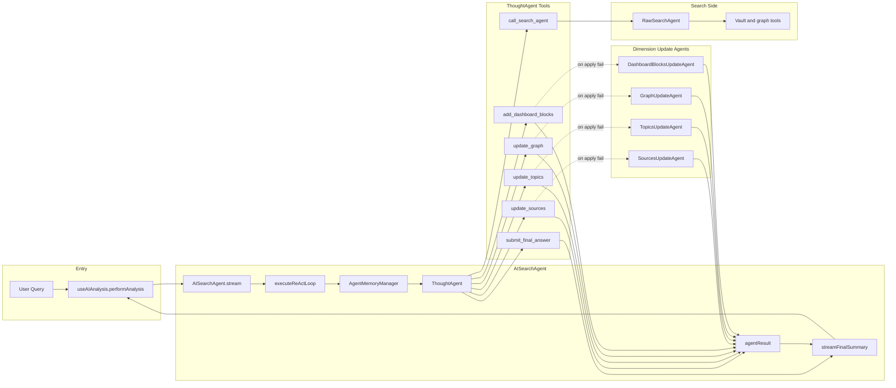
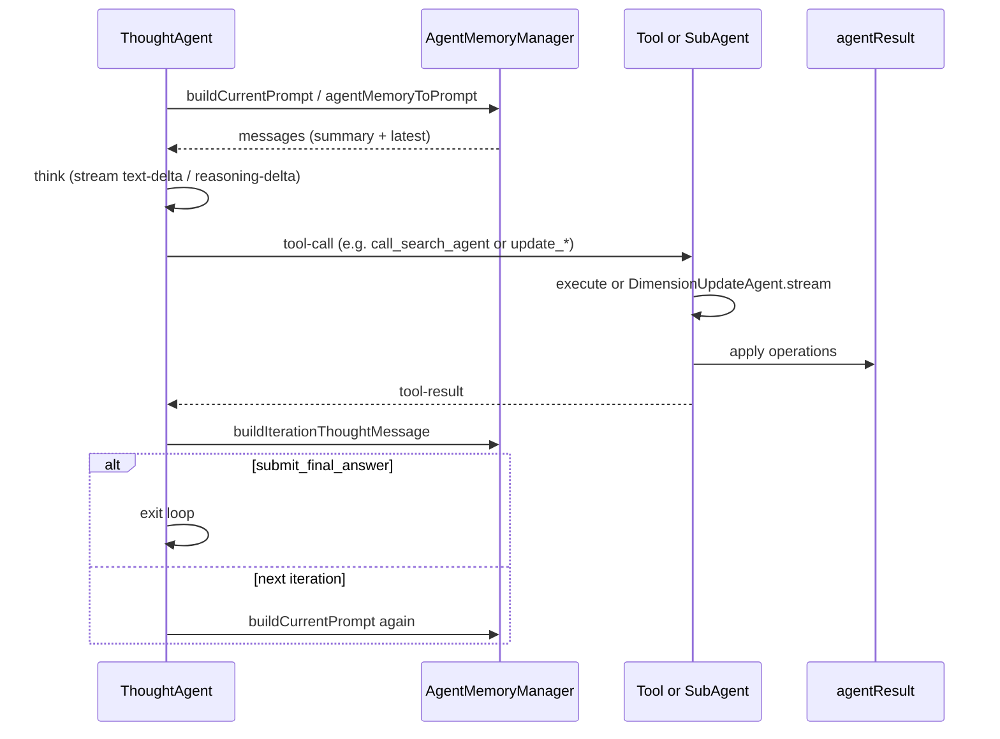

# AI Analysis: Architecture and Prompt Engineering

This document summarizes the **AI Analysis** feature: its architecture, data flow, design rationale, and all prompts involved. It is intended for developers and anyone tuning or extending prompts.

---

## Part 1: Architecture, Data Flow, and Design

### 1.1 Overall Architecture

AI Analysis uses a **multi-agent ReAct** setup: a coordinator (ThoughtAgent) drives a search executor (SearchAgent) and optional dimension-update agents that fix failed tool applications.

#### Agent Layers

| Layer | Role | System prompt | Behavior |
|-------|------|---------------|----------|
| **ThoughtAgent** | Coordinator | `ThoughtAgentSystem` | Runs the ReAct loop: decides when to call `call_search_agent` or `update_sources` / `update_topics` / `update_graph` / `add_dashboard_blocks`, then `submit_final_answer`. |
| **SearchAgent (RawSearchAgent)** | Executor | `AiSearchSystem` | Runs tools (local search, graph, content reader, etc.), returns an Evidence Pack via `submit_final_answer`. |
| **Dimension Update Agents (4)** | Fixers | `SourcesUpdateAgentSystem`, `TopicsUpdateAgentSystem`, `GraphUpdateAgentSystem`, `DashboardBlocksUpdateAgentSystem` | When the ThoughtAgent’s direct `operations` apply fails, the corresponding agent turns “error + original input” into corrected operations JSON. |

#### Data and Memory

- **AgentMemoryManager** holds `AgentMemory`: `initialPrompt`, `historyMessages`, `sessionSummary`, `latestMessages`, `totalTokenUsage`. When history exceeds a token threshold, **DocSummary** compresses older messages into `sessionSummary`; `agentMemoryToPrompt()` then feeds `sessionSummary` + `latestMessages` as the next ThoughtAgent prompt.
- **SearchAgentResult** (`agentResult` in [AISearchAgent](src/service/agents/AISearchAgent.ts)) holds `summary`, `graph`, `dashboardBlocks`, `topics`, `sources`. ThoughtAgent’s update tools write into it; **SearchAiSummary** reads it to produce the final narrative summary.

#### Mermaid: Agents and Data Flow

#### Mermaid: Single ReAct Step (Sequence)

---

### 1.2 Data Flow (Key Points)

- **Entry**: [useAIAnalysis](src/ui/view/quick-search/hooks/useAIAnalysis.ts) `performAnalysis` calls `aiSearchAgent.stream(searchQuery)` and consumes `LLMStreamEvent`.
- **Events and UI**:
  - `tool-call` / `tool-result`: when `toolName` is in `RESULT_UPDATE_TOOL_NAMES`, `event.extra.currentResult` is applied to the store (graph, sources, topics, dashboardBlocks) for incremental UI.
  - `prompt-stream-start` / `prompt-stream-delta` / `prompt-stream-result` with `promptId === SearchAiSummary`: summary is streamed into store and UI.
  - `complete`: final result, usage, and duration are written to the store.
- **EvidenceGate**: SearchAgent tool outputs are passed to [registerVerifiedPathsFromToolOutput](src/service/agents/search-agent-helper/ResultUpdateToolHelper.ts); `verifiedPaths` is used by update-result tools to validate paths and reduce hallucination.

---

### 1.3 Design Rationale

| Decision | Reason |
|----------|--------|
| **ReAct + two main agents** | ThoughtAgent plans and narrates; SearchAgent executes and gathers evidence. Clear separation of roles and explicit Tool Coverage Requirements in AiSearchSystem help control token use and tool usage. |
| **Dimension Update Agents only on failure** | ThoughtAgent usually sends valid `operations` in tool input; the tool applies them directly. Only when that apply fails does a small, dedicated prompt (per dimension) fix the JSON, keeping extra LLM calls minimal. |
| **AgentMemory + DocSummary** | Long conversations are compressed into `sessionSummary` plus a sliding window of `latestMessages`, so context stays within model limits. |
| **Single final summary via SearchAiSummary** | One prompt merges `agentResult` (topics, sources, graph, dashboardBlocks) and session context into a single narrative, with strict “only cite paths from Source Materials” and optional Mermaid overview. |

---

## Part 2: Prompt Engineering Inventory

All AI Analysis–related prompts are listed below by role. Template definitions live under [src/service/prompt/templates/](src/service/prompt/templates/); prompt IDs and variable types are in [PromptId.ts](src/service/prompt/PromptId.ts) (`PromptId` and `PromptVariables`).

### Entry and Main Loop

| Category | PromptId / Template | Purpose | Key Variables | Where used |
|----------|---------------------|----------|----------------|-------------|
| Entry · Thought | `ThoughtAgentSystem` | System prompt for ThoughtAgent: coordination, three acts, tool rules | `analysisMode`, `simpleMode` | [AISearchAgent](src/service/agents/AISearchAgent.ts) `executeReActLoop`: `renderPrompt` then passed as `system` to `thoughtAgent.stream()` |
| Entry · Search | `AiSearchSystem` | System prompt for SearchAgent: tool strategy, coverage, anti-hallucination | `SystemInfo`: e.g. `current_time`, `vault_statistics`, `tag_cloud`, `current_focus` | [RawSearchAgent](src/service/agents/search-agent-helper/RawSearchAgent.ts) `streamSearch`: `renderPrompt` then passed as `system` to `searchAgent.stream()` |

### Session and Final Summary

| Category | PromptId / Template | Purpose | Key Variables | Where used |
|----------|---------------------|----------|----------------|-------------|
| Session summary | `DocSummary` | Compress long history into a short summary | `content`, `title`, `path`, `wordCount` | [AgentMemoryManager.buildCurrentPrompt](src/service/agents/search-agent-helper/AgentMemoryManager.ts): `chatWithPrompt(PromptId.DocSummary, …)` |
| Final synthesis | `SearchAiSummary` | Produce final narrative from `agentResult` + session (incl. Mermaid) | `agentResult`, `agentMemory`, `options`, `latestMessagesText` | [AISearchAgent.streamFinalSummary](src/service/agents/AISearchAgent.ts): `chatWithPromptStream(PromptId.SearchAiSummary, …)`. [useAIAnalysis](src/ui/view/quick-search/hooks/useAIAnalysis.ts) handles `prompt-stream-*` when `promptId === SearchAiSummary` |

### Dimension Update Agents (Fix on Apply Failure)

| Category | PromptId / Template | Purpose | Key Variables | Where used |
|----------|---------------------|----------|----------------|-------------|
| Dimension · Sources | `SourcesUpdateAgentSystem` | Turn Thought text (or error + input) into sources operations JSON | `text`, `lastError` | [DimensionUpdateAgent](src/service/agents/search-agent-helper/DimensionUpdateAgent.ts) for sources; invoked by [makeDimensionManualToolHandler](src/service/agents/search-agent-helper/ResultUpdateToolHelper.ts) when direct apply fails |
| Dimension · Topics | `TopicsUpdateAgentSystem` | Same for topics operations | `text`, `lastError` | Same pattern, topics dimension |
| Dimension · Graph | `GraphUpdateAgentSystem` | Same for graph nodes/edges operations | `text`, `lastError` | Same pattern, graph dimension |
| Dimension · Blocks | `DashboardBlocksUpdateAgentSystem` | Same for dashboardBlocks operations | `text`, `lastError` | Same pattern, dashboardBlocks dimension |

Handlers are wired in [AISearchAgent.initManualToolCallHandlers](src/service/agents/AISearchAgent.ts).

### Post-Result Follow-up (Inline Chat)

| Category | PromptId / Template | Purpose | Key Variables | Where used |
|----------|---------------------|----------|----------------|-------------|
| Follow-up · Summary | `AiAnalysisFollowupSummary` | Answer questions about the current summary | `question`, `summary` | [useAIAnalysisPostAIInteractions.useSummaryFollowupChatConfig](src/ui/view/quick-search/hooks/useAIAnalysisPostAIInteractions.ts) → InlineFollowupChat |
| Follow-up · Graph | `AiAnalysisFollowupGraph` | Answer questions about the graph | `question`, `nodeLabels`, `nodeCount`, `edgeCount` | `useGraphFollowupChatConfig` |
| Follow-up · Sources | `AiAnalysisFollowupSources` | Answer questions about sources list | `question`, `sourcesList` | `useSourcesFollowupChatConfig` |
| Follow-up · Blocks | `AiAnalysisFollowupBlocks` | Answer questions about dashboard blocks | `question`, `blocksText` | `useBlocksFollowupChatConfig` |
| Follow-up · Full / Continue | `AiAnalysisFollowupFull` | Follow-up or “continue analysis” over full summary | `question`, `summary` | `useContinueAnalysisFollowupChatConfig`, `useTopicFollowupChatConfig`; TopicSection’s “analyze topic” uses `chatWithPromptStream(AiAnalysisFollowupFull, { question, summary })` |

### Save Suggestions

| Category | PromptId / Template | Purpose | Key Variables | Where used |
|----------|---------------------|----------|----------------|-------------|
| Save · Filename | `AiAnalysisSaveFileName` | Suggest filename (no extension) for saving analysis | `query`, `summary` | [useAIAnalysisPostAIInteractions.useGenerateResultSaveField](src/ui/view/quick-search/hooks/useAIAnalysisPostAIInteractions.ts) → `generateFileName` → `chatWithPrompt(AiAnalysisSaveFileName, …)` |
| Save · Folder | `AiAnalysisSaveFolder` | Suggest vault-relative folder path | `query`, `summary` | Same hook → `generateFolder` → `chatWithPrompt(AiAnalysisSaveFolder, …)` |

---

## Appendix

### PromptId and Template Path Quick Reference

| PromptId | Template file |
|----------|----------------|
| `ThoughtAgentSystem` | `templates/thought-agent-system.ts` |
| `AiSearchSystem` | `templates/ai-search-system.ts` |
| `DocSummary` | `templates/doc-summary.ts` |
| `SearchAiSummary` | `templates/search-ai-summary.ts` |
| `SourcesUpdateAgentSystem` | `templates/sources-update-agent-system.ts` |
| `TopicsUpdateAgentSystem` | `templates/topics-update-agent-system.ts` |
| `GraphUpdateAgentSystem` | `templates/graph-update-agent-system.ts` |
| `DashboardBlocksUpdateAgentSystem` | `templates/dashboard-blocks-update-agent-system.ts` |
| `AiAnalysisFollowupSummary` | `templates/ai-analysis-followup-summary.ts` |
| `AiAnalysisFollowupGraph` | `templates/ai-analysis-followup-graph.ts` |
| `AiAnalysisFollowupSources` | `templates/ai-analysis-followup-sources.ts` |
| `AiAnalysisFollowupBlocks` | `templates/ai-analysis-followup-blocks.ts` |
| `AiAnalysisFollowupFull` | `templates/ai-analysis-followup-full.ts` |
| `AiAnalysisSaveFileName` | `templates/ai-analysis-save-filename.ts` |
| `AiAnalysisSaveFolder` | `templates/ai-analysis-save-folder.ts` |

### Configurable Prompts (AI Analysis related)

These prompt IDs are in `CONFIGURABLE_PROMPT_IDS` in [PromptId.ts](src/service/prompt/PromptId.ts), so users can assign a different model per prompt in settings:

- `SearchAiSummary`
- `AiAnalysisFollowupSummary`
- `AiAnalysisFollowupGraph`
- `AiAnalysisFollowupSources`
- `AiAnalysisFollowupBlocks`
- `AiAnalysisFollowupFull`

(ThoughtAgent and SearchAgent system prompts use the analysis model configuration; dimension update agents use the ThoughtAgent model. DocSummary and save prompts use the default or their configured model when present.)
