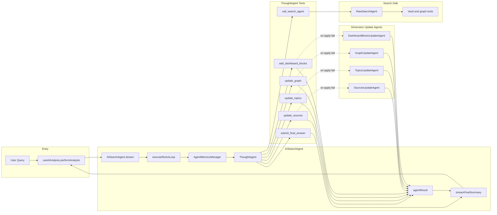
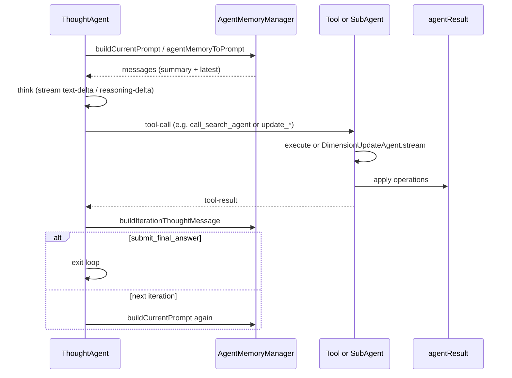

# AI Analysis: Architecture and Prompt Engineering

> **Note (2026-04-12):** The search pipeline has been migrated to the Claude Agent SDK. `AISearchAgent` now uses the Agent SDK's streaming query interface (`SDKMessage` stream) instead of the Vercel AI SDK adapters. The multi-agent ReAct loop described below reflects the V2 Agent SDK implementation. See `docs/superpowers/plans/2026-04-12-vault-search-agent-sdk-migration.md` for migration details.

This document summarizes the **AI Analysis** feature: its architecture, data flow, design rationale, and all prompts involved. It is intended for developers and anyone tuning or extending prompts.

---

## Part 1: Architecture, Data Flow, and Design

### 1.1 Overall Architecture

AI Analysis uses a **multi-agent ReAct** setup: a coordinator (ThoughtAgent) drives a search executor (SearchAgent) and optional dimension-update agents that fix failed tool applications.

#### Agent Layers

| Layer | Role | System prompt | Behavior |
|-------|------|---------------|----------|
| **ThoughtAgent** | Coordinator | `ThoughtAgentSystem` | Runs the ReAct loop: decides when to call `call_search_agent` or `update_sources` / `update_topics` / `update_graph` / `add_dashboard_blocks`, then `submit_final_answer`. |
| **SearchAgent (RawSearchAgent)** | Executor | `AiSearchSystem` | Runs tools (local search, graph, content reader, etc.), returns an Evidence Pack via `submit_final_answer`. |
| **Dimension Update Agents (4)** | Fixers | `SourcesUpdateAgentSystem`, `TopicsUpdateAgentSystem`, `GraphUpdateAgentSystem`, `DashboardBlocksUpdateAgentSystem` | When the ThoughtAgent’s direct `operations` apply fails, the corresponding agent turns “error + original input” into corrected operations JSON. |

#### Data and Memory

- **AgentMemoryManager** holds `AgentMemory`: `initialPrompt`, `historyMessages`, `sessionSummary`, `latestMessages`, `totalTokenUsage`. When history exceeds a token threshold, **AiAnalysisSessionSummary** (not a generic one-shot doc summary) compresses older messages into a **structured** summary (UserBackgroundSignals, GoalAndMotivation, PainPointsAndConstraints, AttemptsAndOutcomes, KeyEvidencePaths, OpenQuestions) so the coordinator keeps decision-critical context. Length is controlled by `aiAnalysisSessionSummaryWordCount` (e.g. 800–3000 chars). `agentMemoryToPrompt()` feeds `sessionSummary` + `latestMessages` as the next ThoughtAgent prompt.
- **SearchAgentResult** (`agentResult` in [AISearchAgent](src/service/agents/AISearchAgent.ts)) holds `summary`, `graph`, `dashboardBlocks`, `topics`, `sources`. ThoughtAgent’s update tools write into it. For the **final summary**, the prompt receives a **minified snapshot** (Handlebars template in [result-snapshot.ts](src/service/agents/search-agent-helper/templates/result-snapshot.ts)) instead of raw JSON: topics/sources/blocks/graph key nodes and a short summary excerpt, to reduce token noise and focus the model on conclusions and recommendations.
- **Evidence hint**: `DashboardUpdateContext.recentEvidenceHint` is built by **buildEvidenceHintFromContext()**: it merges the latest message text, **call_search_agent** tool-result summaries (so tool output is not lost when converting messages to text), and `verifiedPaths` (key paths from evidence), capped at 6000 chars. The **last** iteration’s context is stored (`lastOneGenerationContext`) so the finish-phase summary also gets tool evidence.

#### Mermaid: Agents and Data Flow

#### Mermaid: Single ReAct Step (Sequence)

---

### 1.2 Data Flow (Key Points)

- **Entry**: [useAIAnalysis](src/ui/view/quick-search/hooks/useAIAnalysis.ts) `performAnalysis` calls `aiSearchAgent.stream(searchQuery)` and consumes `LLMStreamEvent`.
- **Events and UI**:
  - `tool-call` / `tool-result`: when `toolName` is in `RESULT_UPDATE_TOOL_NAMES`, `event.extra.currentResult` is applied to the store (graph, sources, topics, dashboardBlocks) for incremental UI.
  - `prompt-stream-start` / `prompt-stream-delta` / `prompt-stream-result` with `promptId === SearchAiSummary`: summary is streamed into store and UI.
  - `complete`: final result, usage, and duration are written to the store.
- **EvidenceGate**: SearchAgent tool outputs are passed to [registerVerifiedPathsFromToolOutput](src/service/agents/search-agent-helper/ResultUpdateToolHelper.ts); `verifiedPaths` is used by update-result tools to validate paths and reduce hallucination.

---

### 1.3 Design Rationale

| Decision | Reason |
|----------|--------|
| **ReAct + two main agents** | ThoughtAgent plans and narrates; SearchAgent executes and gathers evidence. Clear separation of roles and explicit Tool Coverage Requirements in AiSearchSystem help control token use and tool usage. |
| **Dimension Update Agents only on failure** | ThoughtAgent usually sends valid `operations` in tool input; the tool applies them directly. Only when that apply fails does a small, dedicated prompt (per dimension) fix the JSON, keeping extra LLM calls minimal. |
| **AgentMemory + AiAnalysisSessionSummary** | Long conversations are compressed into a **structured** session summary (user background, pains, constraints, evidence paths, open questions) plus a sliding window of `latestMessages`, so the coordinator retains decision-critical context without generic “document summary” loss. |
| **Evidence hint from tool results** | `recentEvidenceHint` is built from latest message text **and** call_search_agent outputs (and verifiedPaths), so dashboard-update and summary prompts see real evidence instead of only the coordinator’s prose (which skipped tool-call/tool-result in the old path). |
| **Minified result snapshot for summary** | The summary prompt gets a Handlebars-rendered, dense text snapshot (topics, sources, blocks, graph key nodes) instead of full `agentResult` JSON, to reduce tokens and focus the model on conclusions and actionable recommendations. |
| **Summary chaining (full mode)** | In `analysisMode === 'full'`, SummaryAgent runs **Step-A** (AiAnalysisDiagnosisJson) to produce structured diagnosis (personaFit, tensions, causalChain, options, oneWeekPlan, risksAndMetrics), then **Step-B** (AiAnalysisSummary) uses that structure plus evidence to write the final markdown. Simple mode skips Step-A. |
| **OutputControl for agents** | ThoughtAgent, RawSearchAgent, and SummaryAgent read `getSettings().defaultOutputControl` (temperature, maxOutputTokens) and pass them into the AI SDK Agent constructor so global or conversation-level tuning applies to the analysis pipeline. |
| **search_analysis_context guidance** | SummaryAgent has the **search_analysis_context** tool (session history search). The summary system and user prompts explicitly tell the model to use it when evidence in the snapshot is thin or when it needs to cite a specific prior step, then ground the synthesis in the retrieved excerpts. |

---

## Part 2: Prompt Engineering Inventory

All AI Analysis–related prompts are listed below by role. Template content lives under [templates/](templates/) (prompts in `templates/prompts/`, tools in `templates/tools/`, agents in `templates/agents/`), maintained via [src/core/template/](src/core/template/) (TemplateRegistry + TemplateManager). Prompt IDs and variable types are in [PromptId.ts](src/service/prompt/PromptId.ts) (`PromptId` and `PromptVariables`).

### Entry and Main Loop

| Category | PromptId / Template | Purpose | Key Variables | Where used |
|----------|---------------------|----------|----------------|-------------|
| Entry · Thought | `ThoughtAgentSystem` | System prompt for ThoughtAgent: coordination, three acts, tool rules | `analysisMode`, `simpleMode` | [AISearchAgent](src/service/agents/AISearchAgent.ts) `executeReActLoop`: `renderPrompt` then passed as `system` to `thoughtAgent.stream()` |
| Entry · Search | `AiSearchSystem` | System prompt for SearchAgent: tool strategy, coverage, anti-hallucination | `SystemInfo`: e.g. `current_time`, `vault_statistics`, `tag_cloud`, `current_focus` | [RawSearchAgent](src/service/agents/search-agent-helper/RawSearchAgent.ts) `streamSearch`: `renderPrompt` then passed as `system` to `searchAgent.stream()` |

### Session and Final Summary

| Category | PromptId / Template | Purpose | Key Variables | Where used |
|----------|---------------------|----------|----------------|-------------|
| Session summary | `AiAnalysisSessionSummary` | Compress long history into a **structured** summary (UserBackgroundSignals, GoalAndMotivation, PainPointsAndConstraints, AttemptsAndOutcomes, KeyEvidencePaths, OpenQuestions) | `content`, `userQuery`, `wordCount` | [AgentMemoryManager.buildCurrentPrompt](src/service/agents/search-agent-helper/AgentMemoryManager.ts): `chatWithPromptStream(PromptId.AiAnalysisSessionSummary, …)` |
| Diagnosis (Step-A) | `AiAnalysisDiagnosisJson` | In full mode, produce structured diagnosis JSON (personaFit, tensions, causalChain, options, oneWeekPlan, risksAndMetrics) for Step-B | `originalQuery`, `recentEvidenceHint`, `currentResultSnapshot` | [SummaryAgent.stream](src/service/agents/search-agent-helper/SummaryAgent.ts): `chatWithPrompt(PromptId.AiAnalysisDiagnosisJson, …)` before summary |
| Final synthesis · System | `AiAnalysisSummarySystem` | System prompt: answer-first, grounding, link format, style example, **CONTEXT SEARCH** (use search_analysis_context when evidence is thin) | (none) | [SummaryAgent.stream](src/service/agents/search-agent-helper/SummaryAgent.ts): rendered as `system` for the summary Agent |
| Final synthesis · User | `AiAnalysisSummary` | Produce final narrative from minified snapshot + evidence hint + optional diagnosisJson | `DashboardUpdateContext`: `originalQuery`, `recentEvidenceHint`, `currentResultSnapshot`, `currentResultSnapshotForSummary`, `diagnosisJson`, etc. | [SummaryAgent.stream](src/service/agents/search-agent-helper/SummaryAgent.ts): `renderPrompt(PromptId.AiAnalysisSummary, { …variables, diagnosisJson })` then passed as `prompt` to the summary Agent. [finishReActLoop](src/service/agents/AISearchAgent.ts) builds context via `buildDashboardUpdateContext()`; `currentResultSnapshotForSummary` comes from [buildMinifiedResultSnapshot](src/service/agents/search-agent-helper/resultSnapshot.ts) (Handlebars template [templates/agents/result-snapshot.md](templates/agents/result-snapshot.md), loaded via TemplateManager + AgentTemplateId.ResultSnapshot). |

**Minified snapshot template** (not a PromptId): [templates/agents/result-snapshot.md](templates/agents/result-snapshot.md) is a Handlebars template used by `buildMinifiedResultSnapshot()` (via TemplateManager) to render a dense text view of `SearchAgentResult` (topics, sources, dashboard blocks, graph counts + key nodes, optional summary excerpt) for the summary prompt only.

### Dimension Update Agents (Fix on Apply Failure)

| Category | PromptId / Template | Purpose | Key Variables | Where used |
|----------|---------------------|----------|----------------|-------------|
| Dimension · Sources | `SourcesUpdateAgentSystem` | Turn Thought text (or error + input) into sources operations JSON | `text`, `lastError` | [DimensionUpdateAgent](src/service/agents/search-agent-helper/DimensionUpdateAgent.ts) for sources; invoked by [makeDimensionManualToolHandler](src/service/agents/search-agent-helper/ResultUpdateToolHelper.ts) when direct apply fails |
| Dimension · Topics | `TopicsUpdateAgentSystem` | Same for topics operations | `text`, `lastError` | Same pattern, topics dimension |
| Dimension · Graph | `GraphUpdateAgentSystem` | Same for graph nodes/edges operations | `text`, `lastError` | Same pattern, graph dimension |
| Dimension · Blocks | `DashboardBlocksUpdateAgentSystem` | Same for dashboardBlocks operations | `text`, `lastError` | Same pattern, dashboardBlocks dimension |

Handlers are wired in [AISearchAgent.initManualToolCallHandlers](src/service/agents/AISearchAgent.ts).

### Post-Result Follow-up (Inline Chat)

| Category | PromptId / Template | Purpose | Key Variables | Where used |
|----------|---------------------|----------|----------------|-------------|
| Follow-up (unified) | `AiAnalysisFollowup` | Answer follow-up questions (Summary, Graph, Sources, Blocks, Full). Caller builds `contextContent`. | `originalQuery`, `question`, `contextContent` | [useAIAnalysisPostAIInteractions](src/ui/view/quick-search/hooks/useAIAnalysisPostAIInteractions.ts) configs → InlineFollowupChat → [FollowupChatAgent](src/service/agents/search-agent-helper/FollowupChatAgent.ts) |

### Save Suggestions

| Category | PromptId / Template | Purpose | Key Variables | Where used |
|----------|---------------------|----------|----------------|-------------|
| Save · Filename | `AiAnalysisSaveFileName` | Suggest filename (no extension) for saving analysis | `query`, `summary` | [useAIAnalysisPostAIInteractions.useGenerateResultSaveField](src/ui/view/quick-search/hooks/useAIAnalysisPostAIInteractions.ts) → `generateFileName` → `chatWithPrompt(AiAnalysisSaveFileName, …)` |
| Save · Folder | `AiAnalysisSaveFolder` | Suggest vault-relative folder path | `query`, `summary` | Same hook → `generateFolder` → `chatWithPrompt(AiAnalysisSaveFolder, …)` |

---

## Part 3: Prompt Design Notes

### 3.1 Session compression (AiAnalysisSessionSummary)

- **Why structured instead of a generic doc summary**: A short generic document summary strips out user-specific signals (location, stage, pains, constraints, evidence paths). The analysis session summary is tuned to preserve exactly those so the ThoughtAgent can continue reasoning with “who is this user, what do they want, what’s blocking them, what paths did we already find.”
- **Sections**: UserBackgroundSignals, GoalAndMotivation, PainPointsAndConstraints, AttemptsAndOutcomes, KeyEvidencePaths (vault paths that appeared in tool results), OpenQuestions. The template instructs the model to omit a section only when there is no evidence.

### 3.2 Evidence hint (buildEvidenceHintFromContext)

- **Why merge tool results**: The coordinator’s messages are converted to text for dashboard/summary via a path that previously **skipped** tool-call and tool-result parts. So the “latest message” was often only the coordinator’s prose, and the actual search round output (Evidence Pack summary) was missing. `buildEvidenceHintFromContext()` pulls call_search_agent tool results (and verifiedPaths) into `recentEvidenceHint` so update agents and the summary see real evidence.
- **lastOneGenerationContext**: Stored after each ThoughtAgent step so that when the finish phase calls `buildDashboardUpdateContext()` with no argument (e.g. for the final summary), the last iteration’s tool evidence is still used.

### 3.3 Minified result snapshot (buildMinifiedResultSnapshot)

- **Why not full JSON**: The full `agentResult` (graph nodes/edges, full reasoning per source, full markdown/mermaid in blocks) is large and noisy for the single task “write a conclusion and recommendations.” The minified snapshot is a Handlebars-rendered, linear text (sections + bullets) with truncated fields (e.g. reasoning 120 chars, summary excerpt 500 chars), so the model spends tokens on answering rather than parsing JSON.
- **Template-driven**: The layout is in [templates/result-snapshot.ts](src/service/agents/search-agent-helper/templates/result-snapshot.ts); changing section order or fields only requires editing the template.

### 3.4 Summary chaining (Step-A diagnosis, Step-B synthesis)

- **Why two steps**: Step-A forces a structured diagnosis (personaFit, tensions, causalChain, options, oneWeekPlan, risksAndMetrics) so the model commits to a clear “user vs goal” and action shape before writing prose. Step-B then expands and cites evidence from that structure, reducing generic or scattered summaries.
- **When**: Only in `analysisMode === 'full'`. Simple mode skips Step-A and uses only the existing summary prompt with the minified snapshot and evidence hint.

### 3.5 search_analysis_context

- **Tool**: SummaryAgent has access to **search_analysis_context** (session history search). The system prompt includes a **# CONTEXT SEARCH** section, and the user prompt DIRECTIVE tells the model to use it when evidence in the snapshot is thin or when it needs to cite a specific prior step, then ground the synthesis in the retrieved excerpts.

---

## Appendix

### PromptId and Template Path Quick Reference

| PromptId | Template file |
|----------|----------------|
| `ThoughtAgentSystem` | `templates/ai-analysis-agent-thought-system.ts` |
| `AiSearchSystem` | `templates/ai-analysis-agent-raw-search-system.ts` |
| `AiAnalysisSessionSummary` | `templates/ai-analysis-session-summary.ts` |
| `AiAnalysisSummarySystem` | `templates/ai-analysis-dashboard-result-summary-system.ts` |
| `AiAnalysisSummary` (SearchAiSummary) | `templates/ai-analysis-dashboard-result-summary.ts` |
| `DashboardBlocksUpdateAgentSystem` | `templates/ai-analysis-dashboard-update-blocks-system.ts` |
| `AiAnalysisFollowup` | `templates/ai-analysis-followup.ts` |
| `AiAnalysisSaveFileName` | `templates/ai-analysis-save-filename.ts` |
| `AiAnalysisSaveFolder` | `templates/ai-analysis-save-folder.ts` |

**Other (not PromptId):** Minified result snapshot layout: [search-agent-helper/templates/result-snapshot.ts](src/service/agents/search-agent-helper/templates/result-snapshot.ts), used by [resultSnapshot.buildMinifiedResultSnapshot](src/service/agents/search-agent-helper/resultSnapshot.ts).

### Configurable Prompts (AI Analysis related)

These prompt IDs are in `CONFIGURABLE_PROMPT_IDS` in [PromptId.ts](src/service/prompt/PromptId.ts), so users can assign a different model per prompt in settings:

- `SearchAiSummary`
- `AiAnalysisFollowup`

(ThoughtAgent and SearchAgent system prompts use the analysis model configuration and pass `temperature` / `maxOutputTokens` from `getSettings().defaultOutputControl` into the Agent constructor. Dimension update agents use the ThoughtAgent model. Session summary and summary prompts use the ThoughtAgent provider/model when invoked from the pipeline; save prompts use the default or their configured model when present.)

### AISearchAgent implementation notes

| Location | Purpose |
|----------|---------|
| [AISearchAgent.buildDashboardUpdateContext](src/service/agents/AISearchAgent.ts) | Builds `DashboardUpdateContext`: `originalQuery`, `recentEvidenceHint` (from `buildEvidenceHintFromContext`), `currentResultSnapshot` (full JSON), `currentResultSnapshotForSummary` (minified). |
| [AISearchAgent.buildEvidenceHintFromContext](src/service/agents/AISearchAgent.ts) | Merges latest message text, call_search_agent tool-result summaries, and verifiedPaths; uses `lastOneGenerationContext` when no context is passed (e.g. finish phase). Capped at EVIDENCE_HINT_MAX_CHARS (6000). |
| [AISearchAgent.lastOneGenerationContext](src/service/agents/AISearchAgent.ts) | Stores the last ThoughtAgent step’s context so the final summary still gets tool evidence when `buildDashboardUpdateContext()` is called without arguments. |
| [resultSnapshot.buildMinifiedResultSnapshot](src/service/agents/search-agent-helper/resultSnapshot.ts) | Builds payload from `SearchAgentResult` and renders with Handlebars using [templates/result-snapshot.ts](src/service/agents/search-agent-helper/templates/result-snapshot.ts). |
| [SummaryAgent.stream](src/service/agents/search-agent-helper/SummaryAgent.ts) | In full mode runs AiAnalysisSummary. Uses search_analysis_context tool; system/user prompts guide when to call it. |
