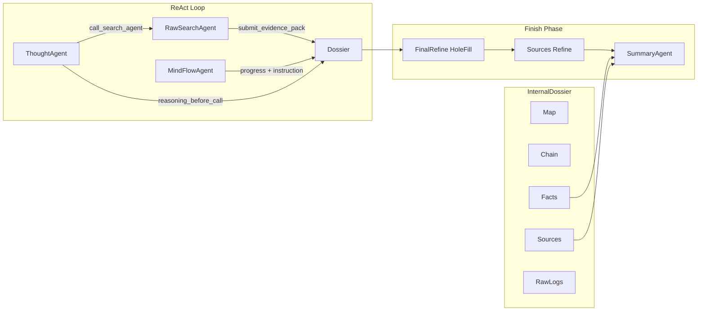

# Research Workflow Engineering (AISearchAgent)

## Overview

AISearchAgent is structured as a **research workflow**: ReAct does discovery and evidence extraction; Memory (InternalDossier) holds and compresses evidence; Summary does synthesis only.

- **ReAct loop**: ThoughtAgent + RawSearchAgent + MindFlowAgent. Discovery and "butchering" (facts + quotes + snippet) happen here.
- **InternalDossier (water tank)**: Map (MindFlow trajectory), Chain (reasoning + actions), Facts (EvidencePacks), Sources (paths/URLs), RawLogs (last N tool summaries). Dedup and compress in Memory layer.
- **Finish phase**: Hole-fill (FinalRefine) → Sources/Refine → Summary. Summary consumes Verified Fact Sheet + Source Map; no new discovery.

## Data flow

## Key types

- **EvidencePack**: `origin` (tool + path_or_url), `facts` (claim + quote + confidence), `snippet` (extract/condensed, 500–800 chars). Supports vault path and URL.
- **DossierMapEntry**: MindFlow progress (decision, instruction, confirmed_facts, gaps).
- **DossierChainEntry**: reasoning_before_call + query per Thought round.

## Rules

- RawSearchAgent must submit evidence_pack with facts (each with quote) and snippet for key sources; otherwise round is PARTIAL/FAILED.
- MindFlow outputs hard **instruction** for ThoughtAgent; no vague "continue searching".
- Summary uses Verified Fact Sheet + Source Map; **get_full_content(path)** only for expanding a cut-off snippet (path from Source Map). **call_search_agent** avoided.
- Web search: reserved as external index shard (tool slot + URL in EvidencePack/sources); not enabled by default.
