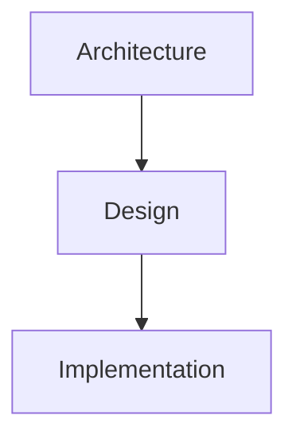
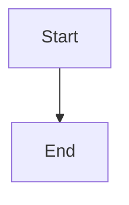
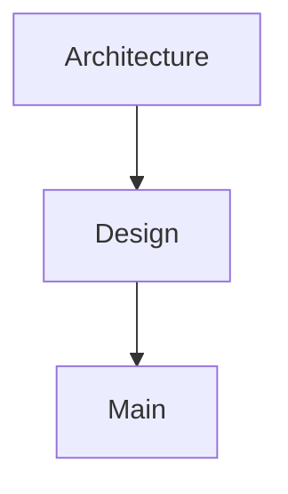

# Summary
This is a complete AI analysis covering project architecture, key concepts, and related notes.

# Query
How does the project work?

# Key Topics
- Architecture (weight: 2)
- Design Patterns (weight: 1)
- Implementation (weight: 1)

# Sources
- [[docs/architecture.md|Architecture Overview]] (score: 0.92)
  badges: core, design
  reasoning: |
    Central document describing system design.
- [[src/main.ts|Main Entry]] (score: 0.85)

# Topic Inspect Results

## Architecture
- [[docs/architecture.md|Architecture Overview]]
- [[docs/design.md|Design Doc]]

## Implementation
- [[src/main.ts|Main Entry]]
- [[src/utils.ts|Utils]]

# Topic Expansions

## Architecture

### Analyze

**Q:** What is the overall structure?
The project uses a modular architecture with clear separation of concerns.

**Q:** How are components connected?
Through well-defined interfaces and dependency injection.

### Graph

# Dashboard Blocks

### Key Insights
- First insight
- Second insight

### Metrics

# Knowledge Graph

