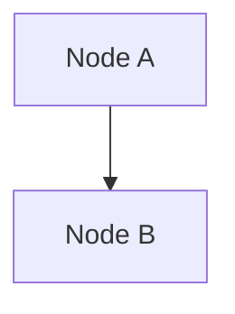
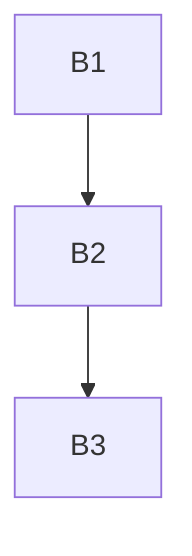
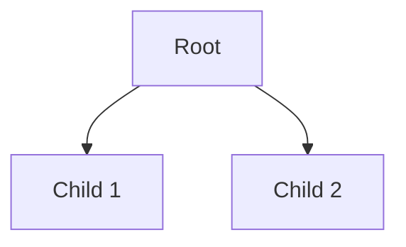

# Summary
Analysis focused on graph structure and mermaid rendering.

# Query
graph visualization

# Key Topics
- Node A (weight: 1)
- Node B (weight: 1)

# Sources
- [[graph/notes.md|Graph Notes]] (score: 0.75)

# Topic Expansions

## Node A

### Graph

## Node B

### Graph

# Knowledge Graph

