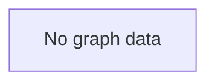

# Summary
Testing source parsing with badges and reasoning.

# Query
sources with extras

# Key Topics

# Sources
- [[note1.md|First Note]] (score: 0.95)
  badges: primary, reference
  reasoning: |
    Main reference for the topic.
    Contains detailed explanations.
- [[note2.md|Second Note]] (score: 0.80)
  badges: secondary
- [[note3.md|Third Note]] (score: 0.70)
  reasoning: |
    Supporting material.
    Single line reasoning.

# Knowledge Graph

