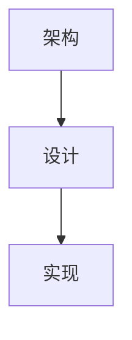

# Summary
这是一个包含 CJK 字符的 AI 分析摘要。包含中文、日文、韩文内容。日本語の説明も含まれています。한국어 설명도 포함되어 있습니다.

# Query
中文 日本語 한국어 测试

# Key Topics
- 架构设计 (weight: 2)
- 実装方法 (weight: 1)
- 구현 세부사항 (weight: 1)

# Sources
- [[文档/架构.md|架构文档]] (score: 0.90)
- [[ドキュメント/設計.md|設計ドキュメント]] (score: 0.85)
- [[문서/구현.md|구현 문서]] (score: 0.80)

# Topic Inspect Results

## 架构设计
- [[文档/架构.md|架构文档]]
- [[docs/design.md|Design]]

## 実装方法
- [[src/main.ts|Main]]

# Topic Expansions

## 架构设计

### Analyze

**Q:** 什么是整体架构？
项目采用模块化架构，具有清晰的职责分离。

**Q:** コンポーネントはどのように接続されていますか？
明確に定義されたインターフェース를介して接続されています。

# Knowledge Graph

